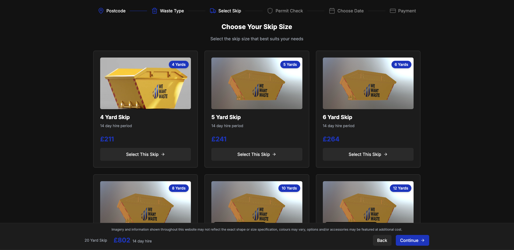
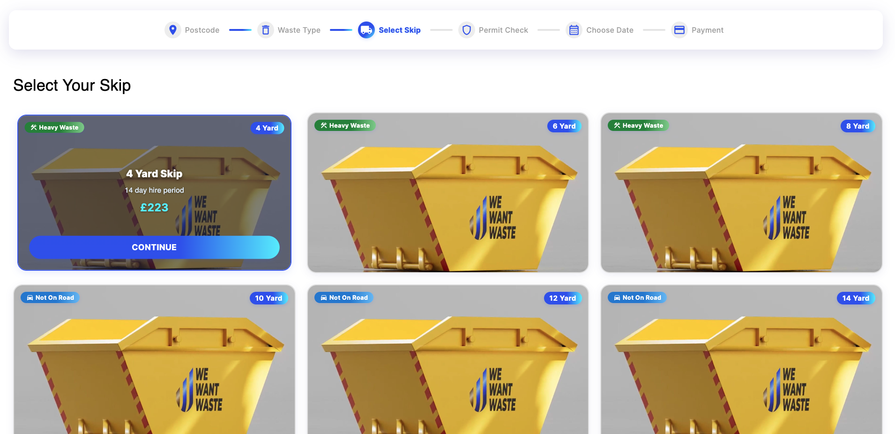
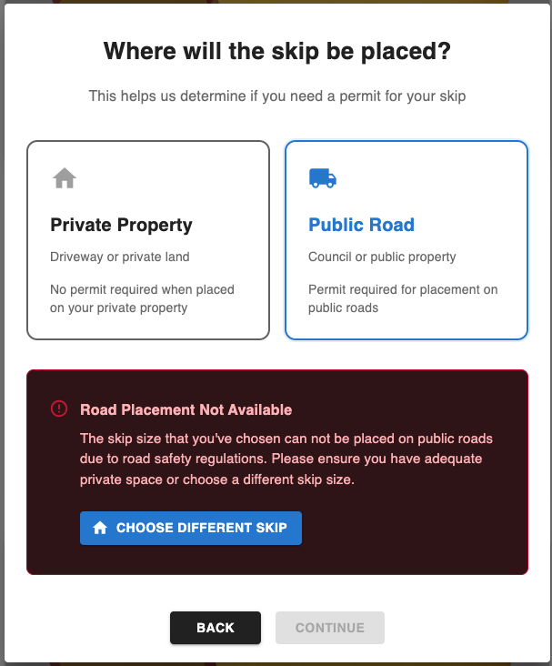

# WeWantWaste - Skip Hire Selection Application

A modern, responsive skip hire selection page built with a focus on clean, maintainable React code and significant UI/UX improvements. This project demonstrates best practices in component architecture, state management, and accessibility, ensuring the page displays and functions seamlessly on both mobile web browsers and desktop devices.

Live demo https://wewantwaste.onrender.com/
## Project Requirements & Implementation

### 1. Complete Page Redesign

- **Modern UI Components**: Implemented a fresh, contemporary design using Material-UI
- **Visual Hierarchy**: Clear organization of skip options with intuitive card-based layout
- **Brand Identity**: Consistent color scheme and visual language throughout the interface
- **Interactive Elements**: Enhanced user engagement through hover effects and transitions

### 2. Functionality Preservation

- **API Integration**: Maintained integration with the original API endpoint (`https://app.wewantwaste.co.uk/api/skips/by-location`)
- **Data Handling**: Preserved all skip data processing and business logic
- **Core Features**: Retained essential functionality while improving the user experience
- **State Management**: Enhanced data flow using TanStack Query for better performance

### 3. Responsive Design Implementation

- **Mobile-First Approach**: Designed primarily for mobile devices, then scaled up
- **Breakpoint System**: Implemented responsive layouts using Material-UI's Grid system
- **Adaptive Components**: Components that adjust their layout based on screen size
- **Touch-Friendly**: Optimized for touch interactions on mobile devices

### 4. Code Quality & Maintainability

- **TypeScript**: Implemented throughout for better type safety and developer experience
- **Component Architecture**: Modular components following SOLID principles
- **Custom Hooks**: Encapsulated business logic in reusable hooks
- **Context API**: Centralized state management for better maintainability

### 5. Performance Optimization

- **Memoization**: Strategic use of useMemo for optimized rendering
- **Efficient State Updates**: Optimized component re-renders through proper state management
- **Data Fetching**: Efficient data fetching with TanStack Query

## Project Structure

```
/src
  /components      # UI components (SkipCard, OrderProgressBar, etc.)
  /contexts        # API and state management
  /hooks          # Custom hooks for data fetching
  /services       # API integration
  /types          # TypeScript definitions
  /pages          # Page components
  /utility        # Helper functions
```

## Technologies Used

- React 18
- TypeScript
- Material-UI (MUI)
- TanStack Query
- Axios
- Vite

## Key Features

- Responsive skip selection interface
- Real-time data fetching from the original API
- Interactive skip cards with detailed information
- Progress tracking through the order process
- Skip placement options (private/public)
- Price calculation with VAT handling
- Mobile-optimized user experience

## Original Skip Selection Page

Below is the original skip selection page that was provided for redesign:



_The original skip selection interface before redesign. The new implementation focuses on improved user experience, accessibility, and modern UI principles._

## Redesigned Skip Selection Page

Below is the redesigned skip selection page, focusing on a modern, user-friendly experience:



_The redesigned skip selection interface, featuring improved usability, accessibility, and a modern visual style._

## Skip Placement Modal Example

Below is an example of the skip placement modal, which guides users to select whether the skip will be placed on private property or a public road:



_The redesigned skip placement modal provides a clear, user-friendly interface for selecting skip placement, ensuring users understand their options and any permit requirements before continuing._

## Getting Started

1. Install dependencies:

   ```bash
   npm install
   ```

2. Start the development server:
   ```bash
   npm run dev
   ```
